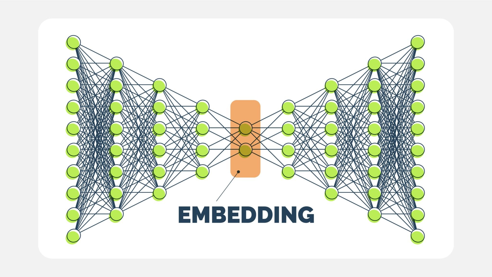

Imputation Methods Implemented in PG-SUI
========================================

This page describes the mathematical formulations and methodologies behind the imputation models implemented in PG-SUI, including **deep learning-based methods (ImputeAutoencoder and ImputeVAE)** and **traditional machine learning methods (IterativeImputer and the MICE algorithm)**.

Autoencoder Model for Genotype Data Imputation
----------------------------------------------

The Autoencoder model is designed to impute missing genotype data by encoding input data into a lower-dimensional latent representation and reconstructing the original input. This process helps capture complex patterns in the data and effectively handles missing values.

Model Overview
~~~~~~~~~~~~~~

An autoencoder consists of two main components:

1. **Encoder:** Maps the high-dimensional input data to a lower-dimensional latent space.
2. **Decoder:** Reconstructs the input data from the latent representation.

The model aims to minimize the reconstruction loss between the original and reconstructed inputs.

Encoder Network
^^^^^^^^^^^^^^^

The encoder network transforms the input data through several hidden layers:

.. math::

    \mathbf{H}_{1} = \sigma(\mathbf{W}_{1} \mathbf{X} + \mathbf{b}_{1})

    \mathbf{H}_{2} = \sigma(\mathbf{W}_{2} \mathbf{H}_{1} + \mathbf{b}_{2})

    \vdots

    \mathbf{Z} = \sigma(\mathbf{W}_{L} \mathbf{H}_{L-1} + \mathbf{b}_{L})

where:

- :math:`\mathbf{X} \in \mathbb{R}^{n \times d}` is the input data.
- :math:`\mathbf{H}_{i}` is the hidden representation at layer :math:`i`.
- :math:`\mathbf{W}_{i}` and :math:`\mathbf{b}_{i}` are the weights and biases of the encoder.
- :math:`\sigma` is the activation function.
- :math:`\mathbf{Z}` is the latent representation of dimension :math:`k`.

Decoder Network
^^^^^^^^^^^^^^^

The decoder reconstructs the original input data from the latent representation:

.. math::

    \mathbf{H}_{i} = \sigma(\mathbf{W}_{i} \mathbf{H}_{i-1} + \mathbf{b}_{i})

    \mathbf{\hat{X}} = \sigma(\mathbf{W}_{\text{out}} \mathbf{H}_{L} + \mathbf{b}_{\text{out}})

where:

- :math:`\mathbf{\hat{X}}` is the reconstructed input.

Loss Function
^^^^^^^^^^^^^

The model uses a masked focal loss to handle missing values and focus on difficult-to-predict data points. The masked focal loss is defined as:

.. math::

    \mathcal{L}_{\text{focal}}(p_t) = - \alpha_t (1 - p_t)^{\gamma} \log(p_t)

The overall loss is computed only over valid (unmasked) entries:

.. math::

    \mathcal{L} = \frac{1}{|M|} \sum_{(i,j) \in M} \mathcal{L}_{\text{focal}}(p_t)

Training Procedure
~~~~~~~~~~~~~~~~~~

The autoencoder is trained using backpropagation with the Adam optimizer and a learning rate scheduler. The key steps in training are:

1. **Forward pass:** Compute the output of the model.
2. **Compute loss:** Calculate the masked focal loss between the original and reconstructed inputs.
3. **Backpropagation:** Compute the gradients of the loss.
4. **Update parameters:** Update the weights and biases of the encoder and decoder.

Variational Autoencoder (VAE) Model for Genotype Data Imputation
-----------------------------------------------------------------

The Variational Autoencoder (VAE) model is designed to impute missing genotype data using a probabilistic approach. The model learns a distribution over the latent space and samples from this distribution to reconstruct the input data.

Model Overview
~~~~~~~~~~~~~~

A VAE consists of three key components:

1. **Encoder:** Maps the input data to a distribution in the latent space.
2. **Latent Space Sampling:** Samples latent variables from the distribution defined by the encoder.
3. **Decoder:** Reconstructs the input data from the sampled latent variables.

Encoder Network
^^^^^^^^^^^^^^^

The encoder maps the input :math:`\mathbf{X}` to the parameters of a Gaussian distribution over the latent space:

.. math::

    \mu = f_{\mu}(\mathbf{X})

    \log \sigma^{2} = f_{\sigma}(\mathbf{X})

where:

- :math:`\mu` is the mean of the distribution.
- :math:`\sigma^{2}` is the variance.
- :math:`f_{\mu}` and :math:`f_{\sigma}` are neural networks representing the encoder.

Latent Space Sampling
^^^^^^^^^^^^^^^^^^^^^

The model samples a latent variable :math:`\mathbf{z}` using the reparameterization trick:

.. math::

    \mathbf{z} = \mu + \epsilon \cdot \sigma, \quad \epsilon \sim \mathcal{N}(0, \mathbf{I})

This allows the model to backpropagate through the sampling step during training.

Decoder Network
^^^^^^^^^^^^^^^

The decoder reconstructs the input data from the sampled latent variables:

.. math::

    \mathbf{\hat{X}} = f_{\text{dec}}(\mathbf{z})

where :math:`f_{\text{dec}}` is a neural network representing the decoder.

Loss Function
^^^^^^^^^^^^^

The VAE loss consists of two components:

1. **Reconstruction Loss:** Measures the difference between the original and reconstructed inputs using a masked focal loss:

    .. math::

        \mathcal{L}_{\text{recon}} = \frac{1}{|M|} \sum_{(i,j) \in M} \alpha_t (1 - p_t)^{\gamma} \log(p_t)

2. **KL Divergence:** Regularizes the learned latent distribution to be close to the prior distribution (a standard normal distribution):

    .. math::

        \mathcal{L}_{\text{KL}} = D_{\text{KL}}(q(\mathbf{z} | \mathbf{X}) \| p(\mathbf{z}))

The total loss is given by:

.. math::

    \mathcal{L} = \mathcal{L}_{\text{recon}} + \beta \mathcal{L}_{\text{KL}}

where :math:`\beta` is a weighting factor that balances the reconstruction and KL divergence losses.

IterativeImputer and the MICE Algorithm
---------------------------------------

**IterativeImputer** in `scikit-learn` is a general-purpose multiple imputation strategy that iteratively models each SNP column based on the most correlated loci.

Multivariate Imputation by Chained Equations (MICE)
~~~~~~~~~~~~~~~~~~~~~~~~~~~~~~~~~~~~~~~~~~~~~~~~~~~

MICE performs **sequential regression-based imputation**, where each missing value is predicted iteratively based on other features.

Let:

- :math:`X = (X_1, X_2, ..., X_p)` be the SNP dataset with missing values.
- :math:`X_{-j}` be all columns except the :math:`jth` one.

For each column :math:`X_j`:

1. **Initialize** missing values using a simple strategy (e.g., mean imputation).
2. **Train a regression model** :math:`f_j` predicting :math:`X_j` using :math:`X_{-j}`:

.. math::

    X_j = f_j(X_{-j}) + \epsilon

where :math:`f_j` is a regression model (e.g., **Random Forest**, **HistGradientBoosting**).

3. **Predict missing values** in :math:`X_j` using :math:`f_j`.
4. **Repeat for all columns** and cycle multiple times (controlled by `max_iter`).

The process stops when convergence is reached (i.e., imputed values stabilize across iterations).

Further Reading
---------------

For additional details, refer to the **scikit-learn documentation**:
`https://scikit-learn.org/stable/modules/impute.html#iterative-imputer`

Conclusion
----------

PG-SUI provides a range of **deep learning, machine learning, and statistical methods** for SNP imputation. **ImputeVAE** and **ImputeAutoencoder** are fully functional deep learning models, and the **IterativeImputer framework** enables regression-based imputation.

For more details, see the `PG-SUI API documentation <pgsui.impute>`_.